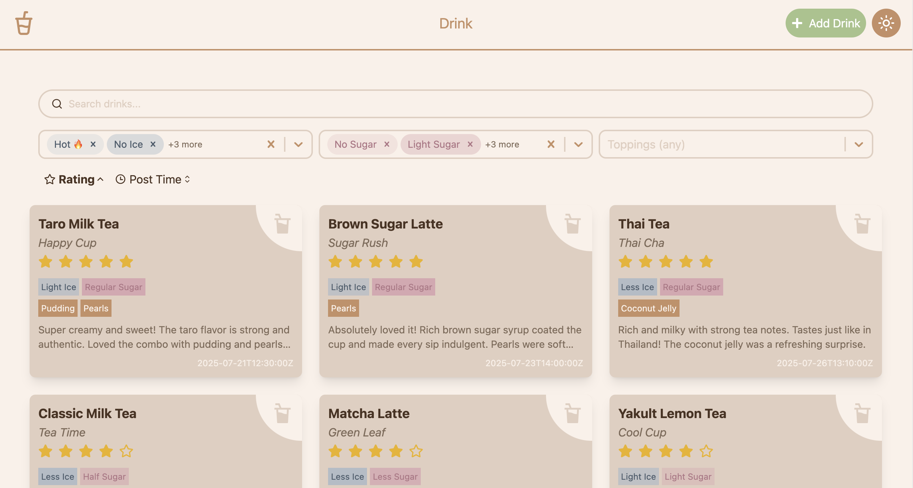

# ⭐️ Star Drink

Welcome to **Star Drink**, your personal and social drink journal.

Forget what you drank or how it tasted? Star Drink helps you record and rate every drink, from sugar and ice levels to toppings. Discover favorites through community reviews, search, and filters.
Built with React, Vite, Tailwind CSS, and TypeScript to deliver a modern, fast, and reliable experience.

## 📷 Screenshot



> ⚠️ **Development Status:** This is version 1 (v1) and the project is under active development. Features and APIs may change.


## 🚀 Features

- 🔍 Filter drinks by ice level, sugar level, and toppings
- 🌟 Rate drinks using a 5-star system
- 📜 Sort reviews by rating or creation time
- 🔁 Toggle between light and dark mode
- 🔄 Real-time data sync with Firebase Firestore
- 💬 Show error messages when invalid drink ID is accessed
- 🌀 Loading overlay during create, read, update, and delete operations
- ✨ Fully responsive UI
- 🏪 Shop list showing selected drink reviews
- 📋 Shop detail page with full reviews
- ⚙️ Shop management page for adding, editing, deleting, and approving
- ✔ Shop approval system to control listing visibility
- ➕ Users can submit reviews and propose new shops

## 🛠️ Tech Stack

- **React** (v18)
- **TypeScript**
- **Vite**
- **Tailwind CSS**
- **React Router DOM** (v7)
- **React Icons**
- **React Select**
- **Firebase (Firestore)** – for managing drink reviews and store data
- **Firebase serverTimestamp & Timestamp** – for consistent time handling
- **date-fns / date-fns-tz** – for date formatting and timezone conversion

## 🚀 Getting Started

### Prerequisites

- Node.js (v18+ recommended)
- npm

### Installation & Development
```bash
npm install
npm run dev
```

### Build for Production
```bash
npm run build
```

## 📁 Project Structure
```bash
src/
├── assets/              # Static assets
├── component/           # Reusable UI components
├── constants/           # App constants (ice/sugar/toppings)
├── context/             # React Context for global state
├── data/                # Mock data
├── layout/              # Header, Footer, Section wrappers
├── page/                # Pages: DrinkList, Detail, Editor
├── types/               # TypeScript types
├── utils/               # Utility functions
└── main.tsx             # App entry point

```

## 🖼️ Attributions
The favicon used in this project was downloaded from Icons8 and is used with attribution.

## 📜 License
This project is licensed under a **custom non-commercial license**.
See the LICENSE file for details.
